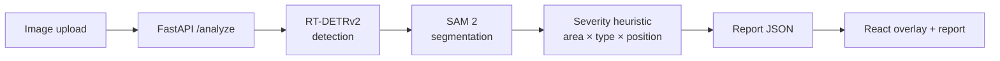

# Car Crash Analyzer

> Computer-vision pipeline for automated vehicle-damage assessment — detection → segmentation → explainable severity → preliminary cost estimate. Portfolio piece targeted at the Mexican insurtech sector.

**Live demo:** [cca.imb-central.tech](https://cca.imb-central.tech) · **Source code:** private (available on request)

> *Screenshot: TBD — open the live demo for the current UI.*

---

## What this is

An end-to-end damage-assessment pipeline that takes a photo of a damaged vehicle and returns:

- Per-damage **detection** by category (dent, scratch, crack, broken glass, broken lamp, flat tire).
- Pixel-precise **segmentation masks** via zero-shot SAM 2.
- **Severity estimation** (mild / moderate / severe) using an auditable heuristic — not an unsupervised model.
- Preliminary **cost ranges in MXN**, documented as a demo placeholder rather than an actuarial model.

The detector is a **fine-tuned RT-DETRv2** trained on the public CarDD dataset (4,000 images, 6 classes). The full stack runs in production at `cca.imb-central.tech` on self-hosted Coolify.

## Why this repo is interesting

- **Real fine-tuning with measured deltas.** Baseline (pretrained COCO, mAP@0.5 = 0.0 — classes don't overlap) → fine-tuned (mAP@0.5 = 0.701) on a single T4 GPU in 74 min of training, with full reproducibility setup documented.
- **22 ADRs.** Every non-trivial decision (backbone choice, segmenter strategy, severity heuristic, mask encoding, frontend chart loading, motion budget, persistence flip) lives as a short, dated, signed document with alternatives considered.
- **LFPDPPP compliance** ([Mexican data-protection law](https://www.diputados.gob.mx/LeyesBiblio/pdf/LFPDPPP.pdf)) is **architected**, not retrofitted: consent capture, ARCO rights endpoint, EXIF stripping, opt-out flow, retention policy. See [ADR 0020](decisions/0020-lfpdppp-compliance-architecture.md).
- **Continued-training loop.** Users can donate images (with explicit consent) for future retraining; a semi-automatic pipeline merges contributions into the next training cycle. See [ADR 0023](decisions/0023-retraining-loop-semi-auto.md).
- **Deployed end-to-end**, not a notebook demo. CPU-only inference budget enforced (`/analyze` p95 ≤ 1.2× baseline), single-image multipart endpoint, 30 req/min per-IP rate limit, structured JSON logs.

## Headline metrics

Eval on the CarDD test split (374 images, 785 annotations, CPU-only Ryzen 7 5800H):

| Metric | Baseline (pretrained COCO) | Fine-tuned (CarDD) | Δ |
|---|---|---|---|
| **mAP@0.5** | 0.0 ¹ | **0.701** | +0.701 |
| **mAP@0.5:0.95** | 0.0 ¹ | **0.536** | +0.536 |
| **Latency mean** (CPU warm) | 581.2 ms | 614.0 ms | +5.7% |
| **Latency p95** | 602.3 ms | 624.0 ms | +3.6% |

¹ Pretrained COCO shares no class with CarDD; `model.val()` is omitted and mAP=0.0 by construction.

**Per-class result.** The three classes with defined edges (`broken_glass` 0.97, `broken_lamp` 0.82, `flat_tire` 0.80) reached production-grade mAP. The three texture/curvature classes (`dent` 0.59, `crack` 0.52, `scratch` 0.51) sat at 0.50–0.59 — the gap reflects the nature of the damage, not a bug. Full breakdown in [`metrics/baseline-vs-finetuned.md`](metrics/baseline-vs-finetuned.md).

## Pipeline

Full layered architecture in [`architecture.md`](architecture.md).

## Tech stack

| Layer | Choice | Notes |
|---|---|---|
| Detector | RT-DETRv2-l (Ultralytics) | Set prediction, no NMS — handles overlapping damages. [ADR 0008](decisions/0008-rtdetr-vs-yolo.md) |
| Segmenter | SAM 2 (transformers) | Zero-shot, prompted by detection bboxes. [ADR 0010](decisions/0010-sam2-zero-shot.md) |
| Severity | Explainable heuristic | `area_ratio × type_weight × position_weight`. [ADR 0011](decisions/0011-severity-heuristic.md) |
| Backend | Python 3.11 · FastAPI · uv · Pydantic v2 | Type-strict, structured logs (loguru), CPU-only torch |
| Frontend | TypeScript · React · Vite · Tailwind · shadcn/ui | Strict mode, glassmorphism dark, lazy-loaded ECharts |
| Animation | Framer Motion | Discrete, not decorative — explicit motion budget. [ADR 0015](decisions/0015-motion-budget.md) |
| Persistence | SQLite + Docker volume | Only `consent=true` images persist. [ADR 0021](decisions/0021-storage-sqlite-volume.md) |
| Email | Resend (transactional) | Post-training notifications. [ADR 0022](decisions/0022-email-resend-transactional.md) |
| Training | Ultralytics on Colab T4 | 74 min train, AdamW, lr 1e-4, 50-epoch budget (40 effective via early-stop). [ADR 0017](decisions/0017-finetune-cardd-result.md) |
| Deploy | Docker Compose · self-hosted Coolify | nginx reverse proxy, CPU-only inference container |

## Decisions

22 ADRs in [`decisions/`](decisions/):

| Theme | ADRs |
|---|---|
| Foundation | [0001 pretrained-first](decisions/0001-pretrained-first.md) · [0008 RT-DETR vs YOLO](decisions/0008-rtdetr-vs-yolo.md) · [0009 cold-start CPU](decisions/0009-cold-start-cpu.md) · [0010 SAM 2 zero-shot](decisions/0010-sam2-zero-shot.md) · [0011 severity heuristic](decisions/0011-severity-heuristic.md) · [0012 mask encoding](decisions/0012-mask-encoding-polygon-cap.md) · [0016 image budget](decisions/0016-backend-image-budget-cpu-torch.md) |
| Frontend & UX | [0005 overlay SVG vs canvas](decisions/0005-overlay-svg-vs-canvas.md) · [0006 nginx serving](decisions/0006-frontend-serving-nginx.md) · [0013 tokens & fonts](decisions/0013-tokens-fonts-strategy.md) · [0014 charts lazy-load](decisions/0014-charts-lazy-load.md) · [0015 motion budget](decisions/0015-motion-budget.md) · [0025 motion flow vs scroll](decisions/0025-motion-budget-flow-vs-scroll.md) |
| Deploy & infra | [0007 nginx proxy](decisions/0007-prod-connectivity-nginx-proxy.md) · [0018 deck tooling](decisions/0018-deck-tooling-marp.md) |
| Fine-tune | [0017 CarDD fine-tune verdict](decisions/0017-finetune-cardd-result.md) |
| Image collection (M7) | [0019 flip persistence](decisions/0019-flip-no-persistence.md) · [0020 LFPDPPP compliance](decisions/0020-lfpdppp-compliance-architecture.md) · [0021 SQLite storage](decisions/0021-storage-sqlite-volume.md) · [0022 transactional email](decisions/0022-email-resend-transactional.md) · [0023 retraining loop](decisions/0023-retraining-loop-semi-auto.md) · [0024 consent default-on](decisions/0024-consent-default-on-with-opt-out.md) |

> ADRs are written in Spanish — the project context is a Mexican insurtech and the design conversation happened in that language. Engineering content is the same in any language; this is left explicit rather than translated.

## Project history

See [`progress.md`](progress.md) for a milestone-by-milestone narrative (M0 scaffold → M8 redesign).

## What this repo is *not*

- Not a production triage system. Cost ranges are placeholders, not actuarial.
- Not a replacement for a human adjuster — it's a pre-evaluation assistant.
- Not the source code. This repo is documentation-only; the implementation is private. Available on request.

## Author

Jesús Moreno · ML / Computer-Vision engineer · Mexico

- **LinkedIn:** *TBD*
- **GitHub:** [@Jesusmcyc](https://github.com/Jesusmcyc)
- **Email:** available on request

## License

Documentation released under [Creative Commons Attribution 4.0 International](LICENSE) (CC BY 4.0).
The implementation code is private. Pretrained models consumed under their respective open-source licenses (RT-DETRv2 via Ultralytics; SAM 2: Apache 2.0).
