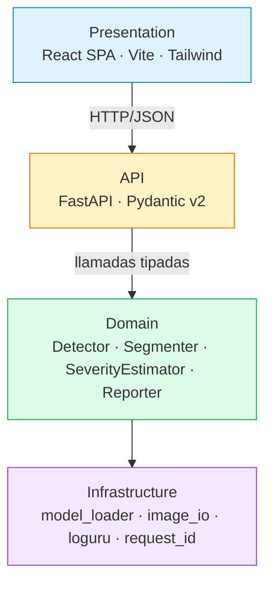
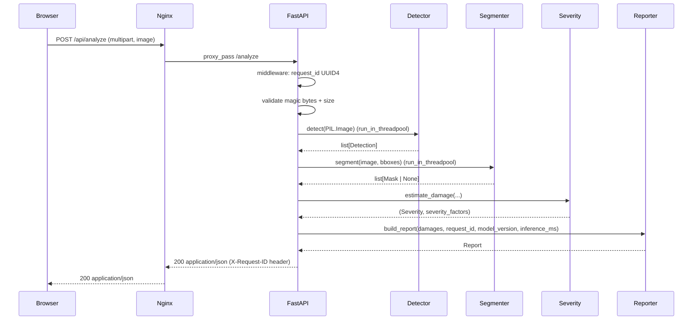
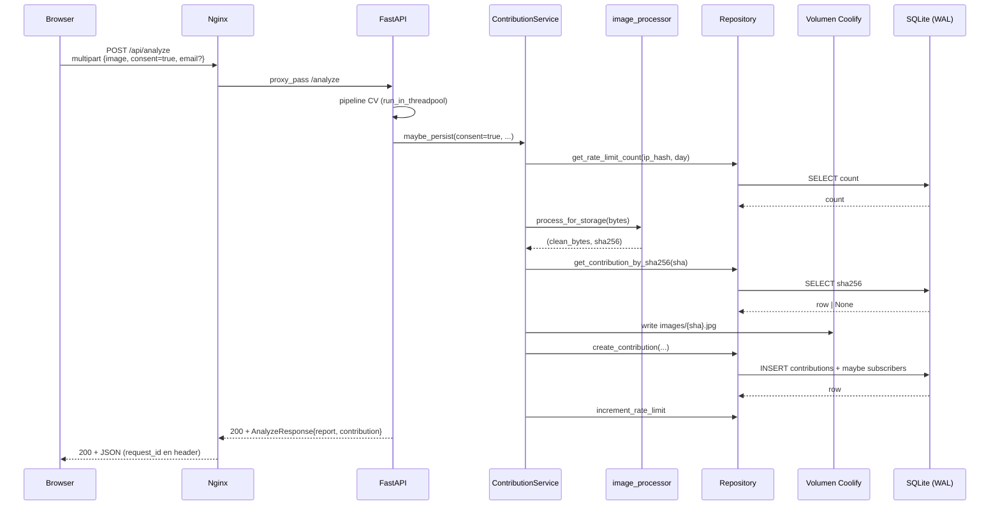
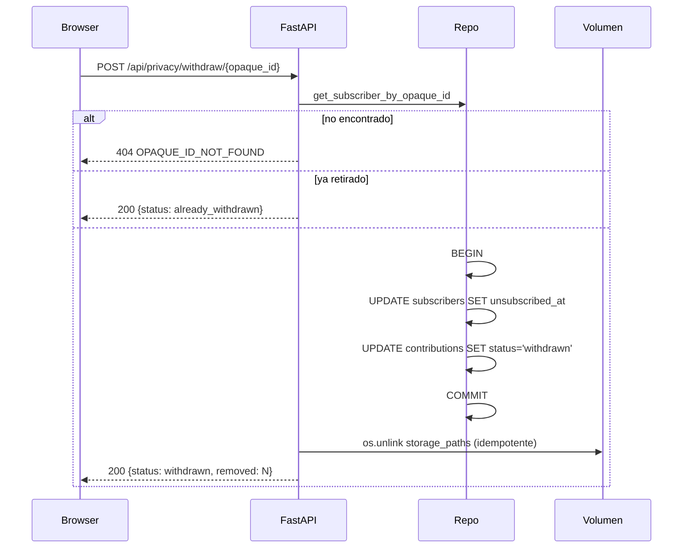

# Architecture — Car Crash Analyzer

> Última revisión: 2026-05-18 (M7 — image collection).

## 1. Vista de capas



**Regla:** una capa solo importa de capas debajo, nunca de capas arriba o laterales.

## 2. Pipeline CV

```mermaid
flowchart LR
    Img[Imagen JPG/PNG/WEBP] --> Pre[Validación magic bytes<br/>+ resize 1024px]
    Pre --> Det[RT-DETRv2 fine-tuned<br/>CarDD weights]
    Det -->|Detection bboxes| Seg[SAM 2 hiera-tiny<br/>zero-shot]
    Seg -->|Mask polígonos| Sev[Severity heurística<br/>area × type × position]
    Sev --> Rep[Reporter<br/>Damage[] + Summary + Meta]
    Rep --> Resp[Response JSON<br/>damages · summary · cost MXN · request_id]
```

Cada componente implementa un Protocol intercambiable. El detector se cambia con `DETECTOR_BACKEND=rtdetr|yolov8` por env var; los pesos se cambian con `DETECTOR_WEIGHTS=/app/models/<peso>.pt`.

## 3. Secuencia /analyze (happy path)



**Error path:** 422 si magic bytes inválidos o no se detecta vehículo; 503 si modelos no precargados; 500 con request_id en body si inferencia falla.

## 4. Componentes y contratos

Cada componente del pipeline implementa un Protocol Python (`@runtime_checkable`) intercambiable:

- **Detector** — `detect(image: PIL.Image) -> list[Detection]`. Implementaciones: `RTDETRDetector` (default), `YOLOv8Detector` (fallback). Patrón **construct-cheap, load-explicit**: el constructor es barato, `.load()` lazy descarga e inicializa el modelo.
- **Segmenter** — `segment(image: PIL.Image, boxes: list[BBox]) -> list[Mask | None]`. Implementación: `Sam2Segmenter` (transformers + SAM 2 hiera-tiny). Devuelve `None` por bbox si la segmentación falla; el reporter usa fallback bbox-polygon.
- **SeverityEstimator** — `estimate_damage(damage_type, mask, bbox, vehicle_bbox, image_dims) -> (Severity, dict)`. Función pura sin estado; pesos por tipo y umbrales documentados en `severity.py` como constantes públicas auditables.
- **Reporter** — `build_report(damages, request_id, model_version, inference_ms) -> Report`. Único dueño del cómputo de `Summary` (severidad global, costo MXN en rangos, conteo por tipo).

Validación de bordes (Pydantic v2 `ConfigDict(frozen=True)`) en todos los tipos del dominio: `Detection`, `Damage`, `Mask`, `Severity`, `Report`, `Summary`, `Meta`.

## 5. Observabilidad

- **request_id UUID4** generado en middleware (`RequestIdMiddleware`); inyectado en `contextvars` para que loguru lo emita en cada log line de la request; emitido como header `X-Request-ID` en la response; incluido en el body de errores 500.
- **Logs estructurados** vía Loguru con `serialize=True` en producción (JSON line-delimited).
- **Healthcheck** Coolify sobre `/api/health`: reporta `status: ok | degraded`, `models_loaded: bool`, `detector_backend: str`, `version: str`. `start_period: 120s` temporal en M2 (margen para cold-start de RT-DETR + SAM 2).
- **CI** GitHub Actions con 3 jobs paralelos+gate (backend lint+types+pytest, frontend lint+typecheck+vitest+build, docker-build buildx + smoke `/health`).

## 6. Despliegue

- **Backend Dockerfile** multi-stage con `python:3.11-slim`. CPU-only torch via `[[tool.uv.index]] pytorch-cpu` para evitar wheels NVIDIA/CUDA (~2.5 GB final, vs ~5–6 GB con stack CUDA completo). Cobertura de fix en ADR 0016.
- **Frontend Dockerfile** multi-stage `node:20-alpine` builder → `nginx:alpine` runtime (~25 MB).
- **docker-compose.yml** dev local; **docker-compose.prod.yml** Coolify con volumen `finetuned-models:/app/models` para pesos custom (M5 T9).
- **Nginx same-origin proxy** `/api → backend:8000` interno: cero CORS, X-Request-ID propagado, un solo dominio público.
- **Coolify** auto-deploy desde `master` con cert Let's Encrypt automático en `cca.imb-central.tech`.

## 7. Referencias cruzadas

| Tópico | ADR |
|---|---|
| Pretrained-first como estrategia de modelado | [0001](decisions/0001-pretrained-first.md) |
| Overlay SVG vs canvas | [0005](decisions/0005-overlay-svg-vs-canvas.md) |
| Frontend serving con nginx | [0006](decisions/0006-frontend-serving-nginx.md) |
| Same-origin /api proxy en prod | [0007](decisions/0007-prod-connectivity-nginx-proxy.md) |
| RT-DETRv2 sobre YOLOv8 | [0008](decisions/0008-rtdetr-vs-yolo.md) |
| Cold-start preload + cache | [0009](decisions/0009-cold-start-cpu.md) |
| SAM 2 zero-shot | [0010](decisions/0010-sam2-zero-shot.md) |
| Severidad heurística multiplicativa | [0011](decisions/0011-severity-heuristic.md) |
| Mask encoding polygon cap | [0012](decisions/0012-mask-encoding-polygon-cap.md) |
| Tokens y self-host de fuentes | [0013](decisions/0013-tokens-fonts-strategy.md) |
| Charts lazy load | [0014](decisions/0014-charts-lazy-load.md) |
| Motion budget de 3 animaciones | [0015](decisions/0015-motion-budget.md) |
| Backend image budget CPU torch | [0016](decisions/0016-backend-image-budget-cpu-torch.md) |
| Fine-tune CarDD verdict deploy | [0017](decisions/0017-finetune-cardd-result.md) |
| Deck tooling Marp | [0018](decisions/0018-deck-tooling-marp.md) |
| Flip "no persistencia" (M7) | [0019](decisions/0019-flip-no-persistence.md) |
| Cumplimiento LFPDPPP | [0020](decisions/0020-lfpdppp-compliance-architecture.md) |
| Storage SQLite + volumen | [0021](decisions/0021-storage-sqlite-volume.md) |
| Email transaccional Resend | [0022](decisions/0022-email-resend-transactional.md) |
| Retraining loop semi-auto | [0023](decisions/0023-retraining-loop-semi-auto.md) |
| Consent default-on con opt-out (M7.1) | [0024](decisions/0024-consent-default-on-with-opt-out.md) |

Vista canónica de capas: ver sec 5.1 abajo.

---

## 8. Contribution flow (M7)

Persistencia condicional al `consent` expreso del visitante. Ver [ADR 0019](decisions/0019-flip-no-persistence.md) para el flip de "no persistencia" + [ADR 0020](decisions/0020-lfpdppp-compliance-architecture.md) para el cumplimiento legal.



**Invariantes garantizados** (ver `app/contributions/service.py` y tests `test_service.py`):

1. `consent=false` ⇒ cero archivos, cero filas DB, cero rate-limit increment.
2. `RateLimitExceededError` se evalúa **antes** de invocar `process_for_storage` (no se desperdicia CPU en requests rejected).
3. Si `INSERT` falla post-write-to-disk, el archivo se borra con `os.unlink` dentro de `except` block.
4. Dedup por sha256 retorna la fila existente sin re-escribir disco ni doble-incrementar rate-limit.

**Privacy by design:**

- EXIF strip + resize 1024 + JPEG q=85 antes de persistir (ver `image_processor.py`).
- IP hasheada con sal diaria UTC (impide tracking longitudinal).
- Email en tabla `subscribers` separada con `opaque_id` UUID4 para URLs de unsubscribe.

---

## 9. Retraining loop (M7)

Cadencia semanal + manual annotation + verdict gate humano. Ver [ADR 0023](decisions/0023-retraining-loop-semi-auto.md).

```mermaid
flowchart LR
    Cron[cron-export<br/>Sunday 02:00 UTC]
    DB[(SQLite<br/>contributions)]
    Export[/app/contributions/exports/<br/>YYYY-WNN/]
    Ops[Operador local]
    Annot[Roboflow / LabelImg<br/>COCO output]
    Yolo[scripts/cardd_coco_to_yolo.py]
    Train[Colab fine-tune<br/>RT-DETRv2]
    Verdict{Verdict<br/>deploy?}
    Deploy[scp rtdetr-cardd-vN.pt<br/>→ Coolify volume]
    Notify[scripts/notify_contributors.py]
    Subs[Subscribers<br/>con email vigente]

    Cron -->|SELECT status='pending'| DB
    DB -->|rows| Cron
    Cron -->|symlinks + manifest.csv| Export
    Export -->|scp manual| Ops
    Ops --> Annot
    Annot -->|COCO JSON| Yolo
    Yolo -->|Dataset YOLO mergeado| Train
    Train -->|eval test split| Verdict
    Verdict -->|sí| Deploy
    Verdict -->|no| Ops
    Deploy --> Notify
    Notify -->|Resend transactional| Subs
```



**Verdict gates** heredados de M5 spec D7: `mAP@0.5 ≥ 0.40 ∧ latencia ≤ 1.2× baseline ⇒ deploy`. Eval se hace **siempre contra test split CarDD original** (374 imgs, 785 anots) — contribuciones nuevas entran solo a train para evitar data leak.

**ARCO Cancelación (withdraw):**



Endpoint **idempotente** + **hard-delete** del archivo físico (LFPDPPP — no admite soft-delete).
